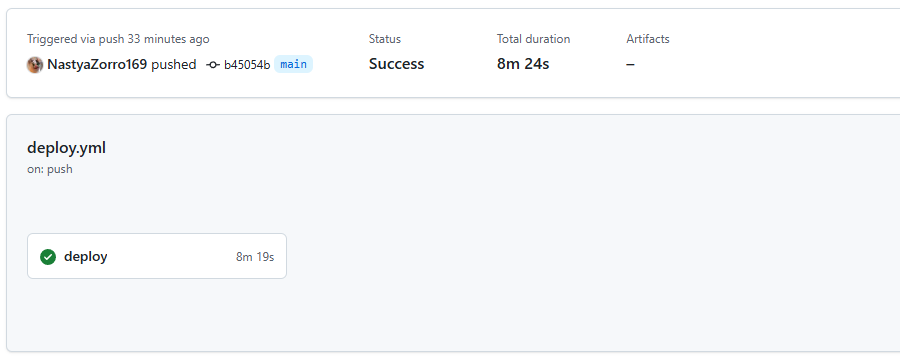

## Зачем тут MLflow и почему это удобно

Я реализовала проект, в котором Flask-приложение оборачивает модель YOLOv5. Простое распознование объектов на картинке.  MLflow тут используется для:

* сохранения версии модели (`mlflow.pytorch.save_model`), т.е. в будущем чтобы MLflow знал, как её загрузить и использовтаь эту модель (чтобы использовтаь в другом проекте)
* регистрации модели в Model Registry, можно давать версии модельке, чтобы потом не запутаться, менять стадии на каком она этапе, в целом удобно, если активно разрабтываешь модель
* логирования результатов запроса: у меня время работы, размер картинки и был ли вообще детект, в целом, чтобы понять зависимость времени обработки изображения от его размера, а был ли детект, чтобы оценить изображения, которые не распознаны и переобучить модель

С MLflow удобно отслеживать, что, когда и как запускалось, и не терять модели и метрики. Вся инфа о модельках лежит в одном месте и доступна через UI.

## CI/CD

Настроен GitHub Actions. На каждый пуш в `main` автоматически:

1. Поднимаются контейнеры `mlflow` и Flask
2. Проверяется, что Flask и MLflow работают (`curl`)
3. Если не работают - фейл

**Деплой прошел успешно.** 

## Terraform

Я пробовала соединить Terraform и запуск MLflow и приложения.... Но из-за нестабильного впн отладка просто была невозможной. Поэтому Terraform-проект отдельно - он поднимает виртуалку и настраивает доступ к S3 в Яндекс Облаке. CI/CD отдельно - он деплоит на GitHub Actions в локальной среде.
Прошу понять и простить..
